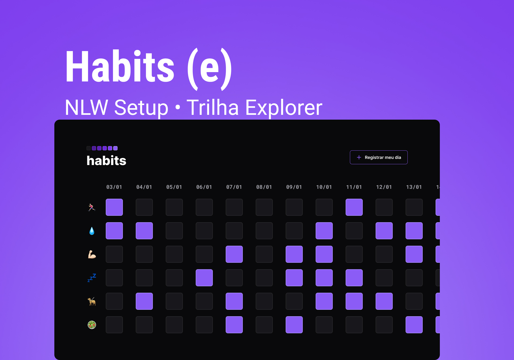

# project-accounts
<h1 align="center"> Habits </h1>

Programa exclusivo, promovido pela Rocketseat para ensino de tecnologias WEB.  

  <a href="#-tecnologias">Tecnologias</a>&nbsp;&nbsp;&nbsp;|&nbsp;&nbsp;&nbsp;
  <a href="#-projeto">Projeto</a>&nbsp;&nbsp;&nbsp;|&nbsp;&nbsp;&nbsp;
  <a href="#-layout">Layout</a>&nbsp;&nbsp;&nbsp;|&nbsp;&nbsp;&nbsp;
  <a href="#memo-licença">Licença</a>

  

 

  

## 🚀 Tecnologias
Esse projeto foi desenvolvido com as seguintes tecnologias:
- HTML e CSS
- JavaScript
- Git e Github
- Figma
## 💻 Projeto

O habits é um projeto voltado a facilitar o controle de atividades e hábitos, para que possa melhorar o gerenciamento do tempo.

Esse projeto está sob a licença MIT.
---
Feito com ♥